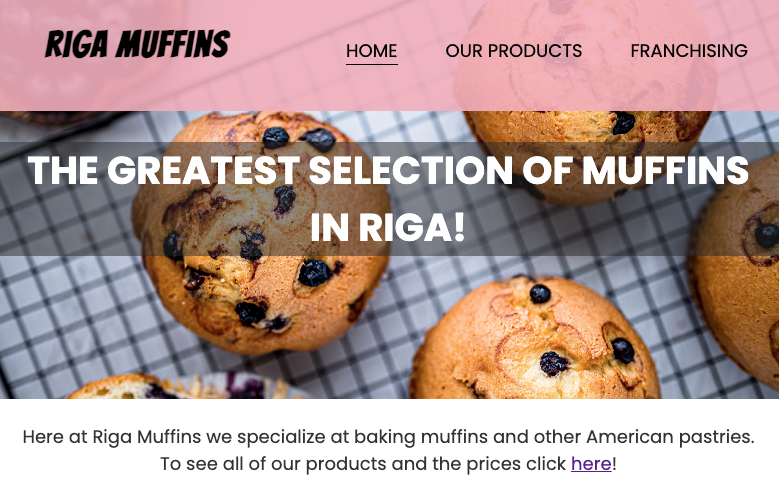

<h2 align="center">RIGA MUFFINS Website</h2>

[Find the project here.](https://lienebriede.github.io/Riga-muffins/)

This is a simple webpage for a muffin shop, but can be used for any other small shop, bakery or cafe that offers a limited selection of goods.  It is designed to be responsive and accessible on a range of devices.

<h2 align="center"></h2>

## User Experience (UX)

-   ### User stories

    #### First Time Visitor Goals

    As a First Time Visitor, I want to learn about the shop.
    I want to navigate easily throughout the site to find content. I want to see what the shop offers and find the links to their social media pages.

    #### Returning Visitor Goals

    As a Returning Visitor, I want to learn more about their products and look for specific products. I also want to find a way to get in contact with the shop and contact them to ask questions about their products or make an order.

    #### Frequent User Goals
    
    As a Frequent User, I want to check to see if there are any newly added products and to contact the shop to make an order.

-   ### Design
    
    #### Colour Scheme
    The colors used (besides black and white) are soft-pink and lemon-yellow. Transparent dark grey is used as the background color for white texts. 
    
    #### Typography
    The main font used for this webpage is Poppins with Sans Serif as the fallback font. Poppins is simple, attractive and used frequently in programming. The other font that is used is Bangers. It is a comic book font and stands out, so it is used only for the logo. The fallback font is cursive.
    #### Imagery
    Images are very important for this page, they catch the user's attention and function as marketing for the shop. They also represent the shop and the products the shop offers. 

## Features

Content

## Technologies Used

### Languages Used

-   [HTML5](https://en.wikipedia.org/wiki/HTML5)
-   [CSS3](https://en.wikipedia.org/wiki/Cascading_Style_Sheets)

### Frameworks, Libraries & Programs Used

1. [Google Fonts:](https://fonts.google.com/)
    Google fonts were used to import the fonts into the style.css file which is used on all pages throughout the project.
1. [Font Awesome:](https://fontawesome.com/)
    Font Awesome was used to add icons for aesthetic and UX purposes.
1. [Git:](https://git-scm.com/)
    Git was used for version control by utilizing the Gitpod terminal to commit to Git and Push to GitHub.
1. [GitHub:](https://github.com/)
    GitHub is used to store the projects code after being pushed from Git.
1. [Photoshop:](https://www.adobe.com/ie/products/photoshop.html)
    Photoshop was used for resizing images for the website.
1. [Figma:](https://figma.com/)
    Figma was used to create the wireframes during the design process.
1. [Google Photos:](https://www.google.com/photos/about/) Google Photos was used for styling the "Our Products" page.
1. [Pexels (a free stock photo site):](https://www.pexels.com/) was used for styling the headers of the page.

### Wireframes

## Testing

The [W3C Markup Validator](https://jigsaw.w3.org/css-validator/#validate_by_input) and [W3C CSS Validator](https://jigsaw.w3.org/css-validator/#validate_by_input) services were used to validate every page of the project to ensure there were no syntax errors in the project.

The Website was tested on Google Chrome and Safari browsers. It was also tested on a variety of devices using [Chrome DevTools](https://developer.chrome.com/docs/devtools/).

Friends were asked to review the site and give feedback.

## Deployment

### GitHub Pages

The project was deployed to [GitHub Pages](https://pages.github.com/). These steps were followed:
1. Log in to your Github.
2. Find the [RIGA MUFFINS repository](https://github.com/lienebriede/Riga-muffins).
3. Select Settings (top-right corner in the navigation menu).
4. Select Pages (left handside of the website).
5. Choose: Deploy from a branch as Source.
6. Choose:  
Source - Deploy from a branch  
Branch - main /root & Save  
7. Select Code (top-left corner in the navigation menu).
8. Select Deployment (right handside od the webpage).
9. Go to the live website by clicking the icon with the arrow (on the right side).

### Content

-   All content was written by the developer.

-   [Sample ReadMe file provided by Code Institute](https://github.com/Code-Institute-Solutions/SampleREADME/blob/master/README.md#first-time-visitor-goals-1file) was used for this ReadMe file.

### Thanks

-   To my sister who owns a muffin shop which gave me the idea to make this website.
-   To my mentor Jack Wachira from CodeInstitute for his help.